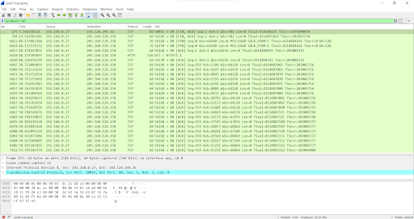

# Jarkom-Modul-1-E01-2022

| Nama Anggota                  | NRP            |
| ----------------------------- | -------------- |
| Afdhal Ma'ruf Lukman          | 05111940007001 |
| Tegar Ganang Satrio Priambodo | 5025201002     |
| Cindi Dwi Pramudita           | 5025201042     |

## List of Contents :

- [Soal 1](#soal-1)
  - [Jawaban](#jawaban-soal-1)
- [Soal 2](#soal-2)
  - [Jawaban](#jawaban-soal-2)
- [Soal 3](#soal-3)
  - [Jawaban](#jawaban-soal-3)
- [Soal 4](#soal-4)
  - [Jawaban](#jawaban-soal-4)
- [Soal 5](#soal-5)
  - [Jawaban](#jawaban-soal-5)
- [Soal 6](#soal-6)
  - [Jawaban](#jawaban-soal-6)
- [Soal 7](#soal-7)
  - [Jawaban](#jawaban-soal-7)
- [Soal 8](#soal-8)
  - [Jawaban](#jawaban-soal-8)
- [Soal 9](#soal-9)
  - [Jawaban](#jawaban-soal-9)
- [Soal 10](#soal-10)
  - [Jawaban](#jawaban-soal-10)
- [Soal 11](#soal-11)
  - [Jawaban](#jawaban-soal-11)
- [Soal 12](#soal-12)
  - [Jawaban](#jawaban-soal-12)
- [Soal 13](#soal-13)
  - [Jawaban](#jawaban-soal-13)
- [Soal 14](#soal-14)
  - [Jawaban](#jawaban-soal-14)
- [Soal 15](#soal-15)
  - [Jawaban](#jawaban-soal-15)

## Soal 1

Sebutkan webserver yang digunakan pada `"monta.if.its.ac.id"`!

## Jawaban Soal 1 :

Webserver yang digunakan adalah **nginx/1.10.3** menggunakan **Display FIlter ip.addr == 192.168.0.27 && http**.

Atau dengan cara pilih **follow to** pada menu analyze->follow->tcp stream.

---

## Soal 2 :

---

Ishaq sedang bingung mencari topik ta untuk semester ini , lalu ia datang ke website monta dan menemukan detail topik pada website **monta.if.its.ac.id** , judul TA apa yang dibuka oleh ishaq ?

## Jawaban Soal 2 :

---

Judul TA yang dibuka adalah **Evaluasi unjuk kerja User Space Filesystem FUSE** oleh Wahyu Suadi

a. ip.addr == 192.168.0.27 && http

b. ip.addr == 192.168.0.27 && http.request.uri contains "detailTopik"

---

## Soal 3 :

---

Ikuti `perintah di basic.ichimarumaru.tech`! **Username dan password** bisa didapatkan dari `file .pcapng`!

## Jawaban Soal 3 :

---

Ketik **http.host contains "basic.ichimarumaru.tech"** di `display filter` wireshark

Lalu kita mengisi pertanyaan di web `basic.ichimarumaru.tech` sebagaimana jawaban juga terlampir

---

## Soal 4 :

---

Filter sehingga wireshark hanya mengambil paket yang berasal dari port 21!

## Jawaban Soal 4 :

---

Menggunakan display filter dengan perintah `tcp.srcport ==21`

---

## Soal 7 :

---

Filter sehingga wireshark hanya mengambil paket yang berasal dari ip kalian!

## Jawaban Soal 7 :

---

Langkah-langkah :

1. Masuk ke gateway wifi yang digunakan dengan menggunakan perintah `ipconfig` pada cmd

2. Sambungkan ke server yang digunakan dengan menggunakan perintah `ping` ip address

3. Setelah berhasil tersambung, display filter dengan menggunakan perintah `ip.src==10.8.108.166`

---

## Soal 10 :

---

Temukan password rahasia (flag) dari organisasi bawah tanah yang disebutkan di atas!

## Jawaban Soal 10 :

---

encrypt file menggunakan ubuntu dan di encrypt menggunakan perintah openssl des3 -d -salt -in E01.des3-out flag.txt
pass : nakano

---

